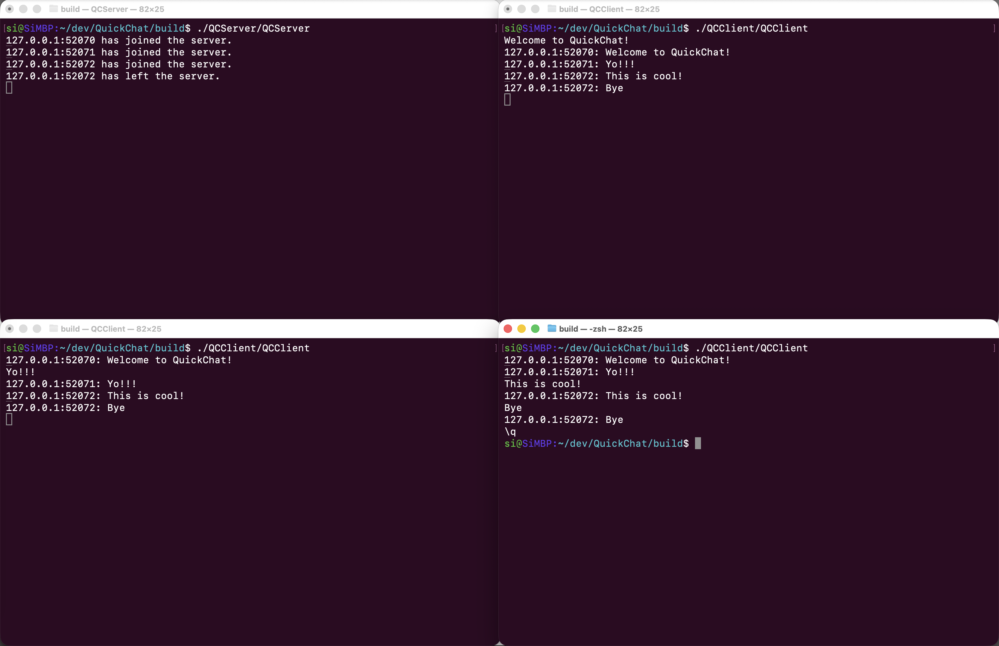
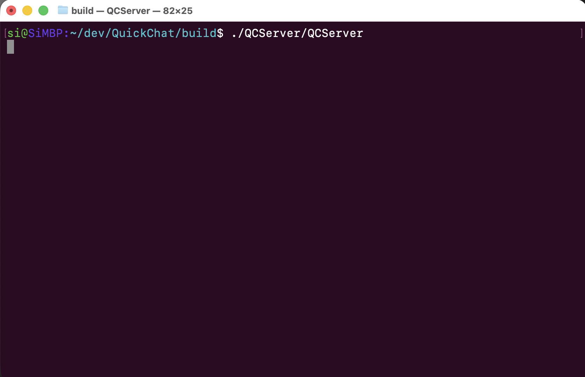
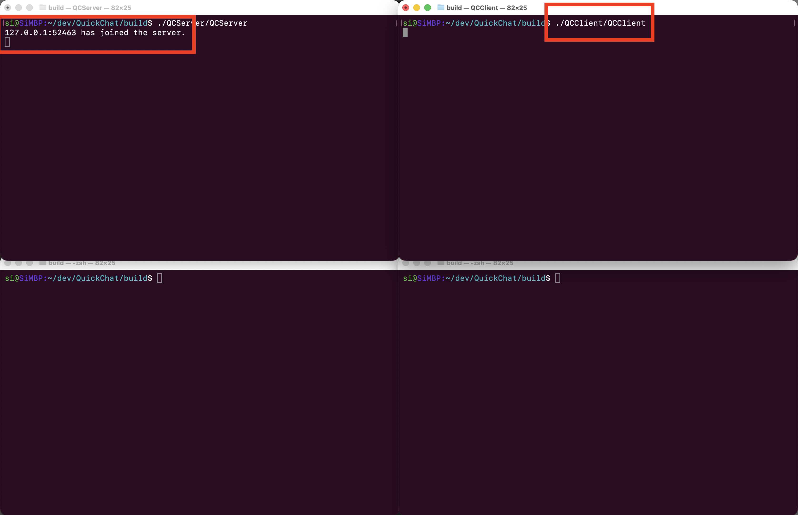
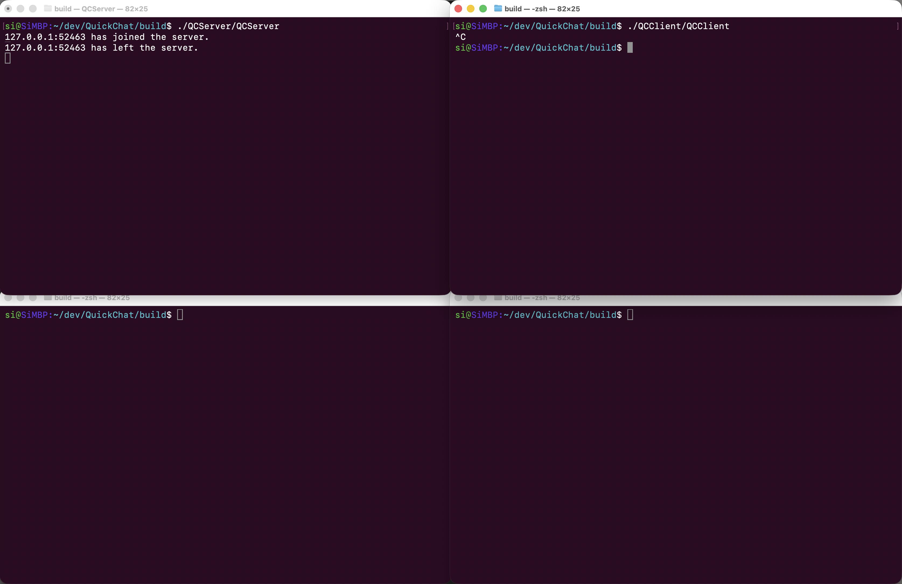
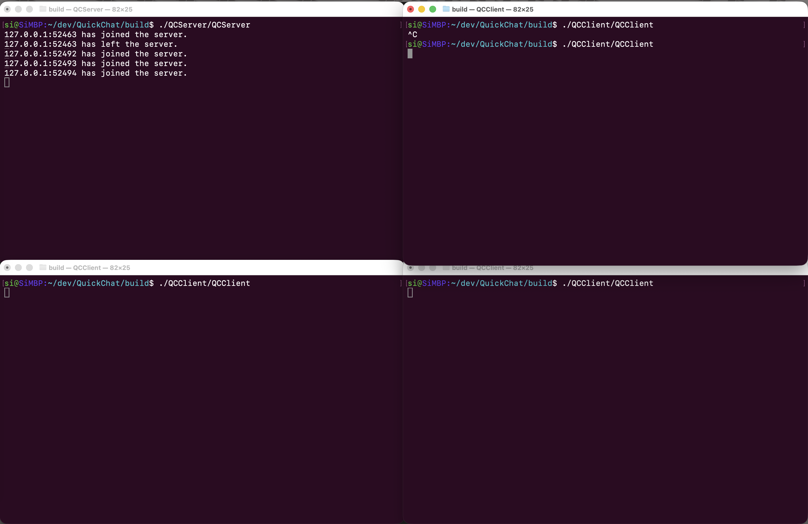
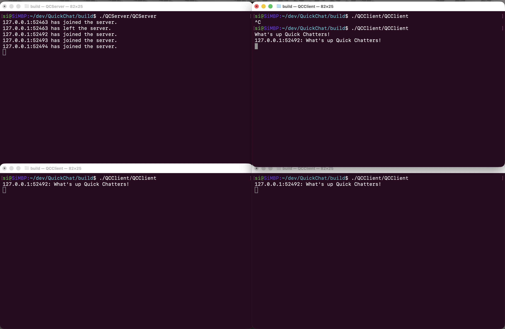

# QuickChat
<p align="center">
  
</p>

## About QuickChat
This project was motivated by wanting to learn about networking and its applications. 

It began by looking into online resources, covering the basics of networking, how it has evolved, and why it plays such a crucial role in connecting the world. Some of the resources I covered were: 
- [Ben Eater's Networking Playlist](https://www.youtube.com/watch?v=XaGXPObx2Gs&list=PLowKtXNTBypH19whXTVoG3oKSuOcw_XeW) on YouTube.
- [Beej's Guide to Network Programming](https://beej.us/guide/bgnet/).

To get my hands dirty and cement my learnings I aimed to build a C++ client and server chat application. Some of the key areas I wanted to focus on for the project were:
- Allowing multiple clients to join the server to imitate a real chat room.
- Explore and implement the Boost.Asio library, as C++'s standard library does not come with networking natively.
- Learn more about CMake.

### Design

Clients attempting to join the server over the local network, meet the server socket, which accepts them and create a TCP connection over the network.

<p align="center">
  
</p>

Clients can then communicate with other connected clients until they either leave or the server is shut down.

### Built With
Sudoku has been built with:

* [![C++][cpp]][cpp-url]
* [![Boost][boost]][boost-url]


## Getting Started

### Prerequisites
* Boost libraries
* C++ Compiler
* CMake version 3.19 or higher


### Quick Start Guide (Mac)

1. Clone the repo
   ```
   git clone https://github.com/santos-eng/QuickChat.git
   ```
3. Install Boost and CMake
   ```
   brew install cmake boost
   ```
4. Build the project
5. Navigate to the build directory:
   ```
   cd ~/QuickChat/build
   ```
6. Create a server:
   ```
   ./QCServer/QCServer
   ```
6. Connect and chat with as many clients as needed:
   ```
   ./QCClient/QCClient
   ```


## Usage
After starting the server, it will begin accepting connections waiting for clients to join.
<p align="center">
  
</p>

Once a client joins (top right), then the server will indicated the joined client (top left). In this example, it is listed on the same localhost IP, however, the PID differentiates multiple clients on the same network.
<p align="center">
  
</p>

If the client wants to leave, they either type `\q` or can kill the process. Notice the server message that its client has left the chat.
<p align="center">
  
</p>

Now lets join all three clients (top right, bottom left, bottom right) to the server (top left).
<p align="center">
  
</p>

Now lets message each other. In the following image, the top right client (PID 52492) will broadcast out a message to all clients.
<p align="center">
  
</p>

Now you can continue to chat until leaving or the server shuts down!

[cpp]: https://img.shields.io/badge/C++-%2300599C.svg?logo=c%2B%2B&logoColor=white
[cpp-url]: https://cplusplus.com/

[boost]: https://img.shields.io/badge/boost-green
[boost-url]: https://www.boost.org/